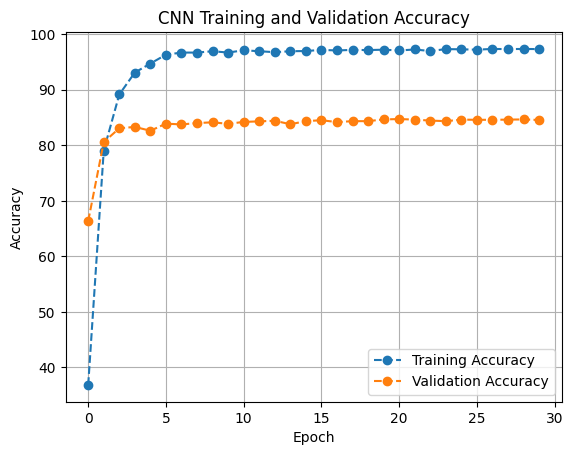

# Convolutional neural networks (CNN) for image classification

Convolutional neural networks are deep learning models used to perform different tasks to be performed, they are mostly known for image classifications.

In this project, we perform an analysis of the workflow of these networks by leveraging to the full extent (i.e. training, validation and testing) of built-in neural networks such as _AlexNet_, _ResNet_ and _VGG_.

The analysis will be conducted in the following manner:

- **From scratch using _AlexNet_**
- **Using Pretrained _AlexNet_**
- **Training only the fully connected layers of _AlexNet_**
- **Training only the convolutional layers of _AlexNet_**
- **Performing Data Augmentation on the training dataset**
- **From scratch using _VGG_**
- **Using Pretrained _VGG_**
- **Using _ResNet_ without transfer learning**
- **Using _ResNet_ with transfer learning**

## Author

- [@peteralhachem](https://github.com/peteralhachem)

## Badges

## Dataset

The analysis will be performed using the **Caltech-101 dataset**: a collection of images organized into 101 object categories (e.g., airplanes, faces, flowers) and one background category. It contains approximately 9,146 images, with each category having 40 to 800 images.

_Figue 1: Sample images of the Caltech-101 dataset_

We further analyze the dataset in hand by plotting the distribution of the number of images per category:

_Figure 2: Number of images per category in the Caltech-101 dataset_

We can detect a substantial imbalance in the dataset, which may cause a bias in the model's performance. In fact, the model may perform well on the categories with a large number of images and poorly on the categories with a small number of images.

## Models

To perform the analysis of the workflow of convolutional neural networks, we will use the following models:

### AlexNet

AlexNet is a convolutional neural network that is trained on more than a million images from the ImageNet database. It consists of 5 convolutional layers and 3 fully connected layers. The network is trained on the ImageNet dataset, which consists of 1.2 million images in 1000 classes. In order to mitigate the difference in the number of classes between ImageNet and the dataset we are using, we will overwrite the number of classes in the AlexNet model to match the number of classes in the Caltech-101 dataset.

Here is an overview of the AlexNet model architecture:

_Figure 3: AlexNet_

### VGG

VGG is a convolutional neural network that is trained on more than a million images from the ImageNet database. It consists of 16 convolutional layers and 3 fully connected layers. The network is trained on the ImageNet dataset, which consists of 1.2 million images in 1000 classes. In order to mitigate the difference in the number of classes between ImageNet and the dataset we are using, we will overwrite the number of classes in the VGG model to match the number of classes in the Caltech-101 dataset.

### ResNet

ResNet is a convolutional neural network that is trained on more than a million images from the ImageNet database. It consists of 50 convolutional layers and 1 fully connected layer. The network is trained on the ImageNet dataset, which consists of 1.2 million images in 1000 classes. In order to mitigate the difference in the number of classes between ImageNet and the dataset we are using, we will overwrite the number of classes in the ResNet model to match the number of classes in the Caltech-101 dataset.

## Model Evaluations

To evaluate the performance of the models, we will use the following metric:

- **Accuracy**: the proportion of correctly classified images.

### AlexNet from scratch

The model is trained from scratch on the Caltech-101 dataset. The training and validation accuracy are plotted as a function of the number of epochs:

_Figure 4: AlexNet from scratch for LR: 0.01 MOMENTUM: 0.9 WEIGHT_DECAY: 5e-5_

A primitive analysis of the result shows that a significantly low accuracy is achieved, which is expected due to the imbalance dataset as the accuracy with respect to the training and validation set fluctuates around the same values as the epochs increase.

This means that the model is not learning well from the training data and is not generalizing well to the validation data. This is mainly due to the to the scarcity of the data in the dataset and thus, affecting the performance of the model when trained from scratch.

**The final accuracy** that was obtained when using the testing dataset is equal to **45.53%.**

### AlexNet with pretrained weights

The model is trained on the ImageNet dataset and then fine-tuned on the Caltech-101 dataset.\
We, additionally, adapt the mean and standard deviation to the ones used in the pretrained AlexNet so that the transformation on the images are identical to the original dataset.

The training and validation accuracy are plotted as a function of the number of epochs:

_Figure 5: AlexNet with pretrained weights for LR: 0.01, MOMENTUM: 0.9, WEIGHT_DECAY: 5e-5, STEP_SIZE: 20_

We remark that the model obtain a higher accuracy compared to the model trained from scratch.
The model is able to learn from the training data and generalize well to the validation data. This is mainly due to the fact that the model is initialized with weights that have been learned on a large dataset (_ImageNet_), which helps the model to learn better from the smaller dataset (_Caltech-101_).

We also notice that the hyperparameters chosen for the model are identical to the ones used in the model trained from scratch. We deduce this phenomenon from the fact that the _stochastic gradient descent_ algorithm, in its quest for searching a minimum, is able to "move" in the same intended direction according to the dataset chosen.

**The final accuracy** that was obtained when using the testing dataset is equal to **83.68%.**

### AlexNet with only the fully connected layers trained

In this step of the analysis, we freeze the convolutional layers of the pretrained AlexNet model and only train the fully connected layers on the Caltech-101 dataset.\
We mean by freezing the convolutional layers that the weights of these layers are not updated during the training process and only the weights of the fully connected layers are updated.

The training and validation accuracy are plotted as a function of the number of epochs:

_Figure 6: AlexNet with only the fully connected layers trained for LR: 0.01, MOMENTUM: 0.9, WEIGHT_DECAY: 5e-5, STEP_SIZE: 20_

We can see by the results that the margin of difference between pretrained AlexNet and AlexNet with only the fully connected layers trained is not significant. This is mainly due to the fact that the fully connected layers are the ones that are responsible for the classification task, and thus, the model is able to learn well from the training data and generalize well to the validation data.

**The final accuracy** that was obtained when using the testing dataset is equal to **85.23%.**

### AlexNet with only the convolutional layers trained

In this step of the analysis, we freeze the fully connected layers of the pretrained AlexNet model and only train the convolutional layers on the Caltech-101 dataset.\
We mean by freezing the fully connected layers that the weights of these layers are not updated during the training process and only the weights of the convolutional layers are updated.

The training and validation accuracy are plotted as a function of the number of epochs:

_Figure 7: AlexNet with only the convolutional layers trained for LR: 0.01, MOMENTUM: 0.9, WEIGHT_DECAY: 5e-5, STEP_SIZE: 20_

We can see by the results that the model is not able to learn well from the training data and generalize well to the validation data. This is mainly due to the fact that the convolutional layers are responsible for extracting features from the images, and thus, the model will perform badly with respect to when the fully connected layers are solemnly trained.

**The final accuracy** that was obtained when using the testing dataset is equal to **47.53%.**

### AlexNet with data augmentation

Deep learning performs better when the dataset is large and diverse. However, _Caltech-101_ is a very small dataset compared to other datasets like _ImageNet_.\
In this step of the analysis, we use data augmentation as a possible solution for this matter.\
This process is performed through the artificial increase of the dataset size by applying transformations at training
time to the images.\

We will perform three different types of data augmentation:

- **Random horizontal flip**: the image is flipped horizontally with a probability of 0.5.
- **Image brightness**: the brightness of the image is randomly adjusted.
- Combining the two previous transformations.

The training and validation accuracy are plotted as a function of the number of epochs for all three types of data augmentation:

_Figure 8: AlexNet with data augmentation (random horizontal flip) for LR: 0.01, MOMENTUM: 0.9, WEIGHT_DECAY: 5e-5, STEP_SIZE: 20_

_Figure 9: AlexNet with data augmentation (image brightness) for LR: 0.01, MOMENTUM: 0.9, WEIGHT_DECAY: 5e-5, STEP_SIZE: 20_

_Figure 10: AlexNet with data augmentation (random horizontal flip and image brightness) for LR: 0.01, MOMENTUM: 0.9, WEIGHT_DECAY: 5e-5, STEP_SIZE: 20_

We notice that none of the data augmentation parameters that were considered were able to improve the model's performance.

With a narrow decrease in the loss function when it comes to using a random horizontal flip, we do distinguish an increase
time to train of the model with respect to the prebvious models that were used when no data augmentation was performed.

**The final accuracy** that was obtained when using the testing dataset is equal to **83.51%.**

### Beyond AlexNet (VGG-16 & ResNet-50)

We now consider a change in the model architecture as a whole by swtiching from the AlexNet model to the VGG-16 and ResNet-50 models.\

These model differ from AlexNet in the number of layers and the architecture of the model.\

We will use the same approach as we did with AlexNet, by training the model using only its pretrained weights versions, as we aim to compare the performance of these models with respect to AlexNet.

#### VGG-16

In this section, we discuss the results of the VGG-16 model that was used, it is important to note that
the learning rate of the VGG-16 model was changed from the previous models to be equal to 0.001, as fast study on the loss showed that that model
performed better at this learning rate instead of the usual one used for AlexNet.

The training and validation accuracy are plotted as a function of the number of epochs:

_Figure 11: VGG-16 with pretrained weights for LR: 0.001, MOMENTUM: 0.9, WEIGHT_DECAY: 5e-5, STEP_SIZE: 20_

It is wildly significant that the VGG-16 model outperforms the AlexNet model in terms of accuracy, as the additional layers in the deep network are able to extract more features from the images, which helps the model to learning process of the model.

**The final accuracy** that was obtained when using the testing dataset is equal to **92.12%.**

#### ResNet-50

In this section, we discuss the results of the ResNet-50 model that was used.
ResNet-50 was also pretrained on the ImageNet dataset and then fine-tuned on the Caltech-101 dataset.

The training and validation accuracy are plotted as a function of the number of epochs:

_Figure 12: ResNet-50 with pretrained weights for LR: 0.01, MOMENTUM: 0.9, WEIGHT_DECAY: 5e-5, STEP_SIZE: 20_

We can see that the ResNet-50 model outperforms the AlexNet model in terms of accuracy, as the residual connections in the deep network help to mitigate the vanishing gradient problem, while it gives similar results to the ones we have seen in the VGG-16 model.

**The final accuracy** that was obtained when using the testing dataset is equal to **91.58%.**

### Conclusion

Recent machine learning models have significantly enhanced performance, achieving faster convergence during training and higher accuracy on test sets.

### References

[1] Dataset - [Caltech-101](http://www.vision.caltech.edu/Image_Datasets/Caltech101/)

[2] J. Deng, W. Dong, R. Socher, L.-J. Li, K. Li and L. Fei-Fei, "ImageNet: A Large-Scale Hierarchical Image Database," 2009 IEEE Conference on Computer Vision and Pattern Recognition, Miami, FL, USA, 2009, pp. 248-255, doi: 10.1109/CVPR.2009.5206848. - [paper](https://ieeexplore.ieee.org/document/5206848)

[3] Li Fei-Fei, R. Fergus and P. Perona, "Learning Generative Visual Models from Few Training Examples: An Incremental Bayesian Approach Tested on 101 Object Categories," 2004 Conference on Computer Vision and Pattern Recognition Workshop, Washington, DC, USA, 2004, pp. 178-178, doi: 10.1109/CVPR.2004.383. - [paper](http://www.vision.caltech.edu/feifeili/Fei-Fei_GMBV04.pdf)

[4] Krizhevsky, Alex & Sutskever, Ilya & Hinton, Geoffrey. (2012). ImageNet Classification with Deep Convolutional Neural Networks. Neural Information Processing Systems. 25. 10.1145/3065386 - [paper](https://papers.nips.cc/paper/4824-imagenet-classification-with-deep-convolutional-neural-networks.pdf)
